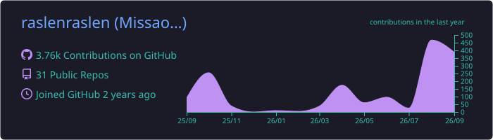
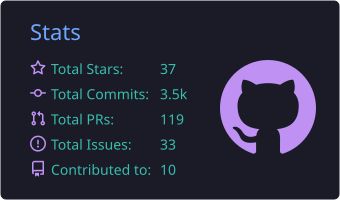
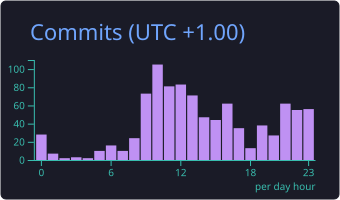
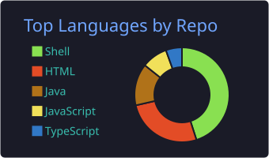
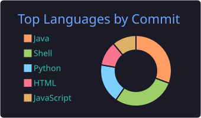

<p align="center">
  
</p>

<p align="center">
  <a href="https://www.linkedin.com/in/missaoui-raslen-6a8620298/"></a>
  <a href="https://twitter.com/RaslenMiss45861"></a>
  
</p>

---

### About Me

DevOps & Cloud Engineer focused on building automated, secure, and scalable infrastructures. I design CI/CD pipelines, deploy Kubernetes clusters, implement GitOps workflows, and set up production monitoring stacks.

```yaml
role:      DevOps & Cloud Engineer
location:  Tunisia
focus:     [ CI/CD, Infrastructure as Code, GitOps, Observability ]
working:   Multi-tenant architectures & production-grade deployments
mindset:   Automate it, secure it, then make it observable
```

---

### Featured Work

| Project | What it does | Stack |
|---|---|---|
| **[kubernetes-ansible-roles](https://github.com/raslenraslen/kubernetes-ansible-roles)** | Bootstraps a multi-node Kubernetes **v1.28** cluster from scratch — master/worker roles, templated join tokens, node-scaling and cluster-reset playbooks | `Ansible` `Kubernetes` |
| **[devsecops-ansible-platforme](https://github.com/raslenraslen/devsecops-ansible-platforme)** | Runtime security platform for K8s, fully automated — **Falco** threat detection + **OPA Gatekeeper** policy enforcement, packaged as reusable roles | `Ansible` `Falco` `OPA` |
| **[kubernetes-ingress-tls-mastery](https://github.com/raslenraslen/kubernetes-ingress-tls-mastery)** | End-to-end ingress & TLS on **Azure** — MetalLB, SAN certificate generation, production ingress manifests with automated cert issuance | `Azure` `Ingress` `TLS` |
| **[k8s-opa-gatekeeper](https://github.com/raslenraslen/k8s-opa-gatekeeper)** | Policy-as-code guardrails on Kubernetes — Gatekeeper constraint templates layered on an Ansible-provisioned cluster | `OPA` `Kubernetes` |
| **[MetalLB-Configuration](https://github.com/raslenraslen/MetalLB-Configuration)** | Bare-metal load balancing — `IPAddressPool` + `L2Advertisement` config, shipped with the full Ansible cluster build | `MetalLB` `Ansible` |
| **[projet-openstack](https://github.com/raslenraslen/projet-openstack)** | Private cloud infrastructure built on **OpenStack** — Controller, Compute and Storage service configuration | `OpenStack` `Shell` |
| **[kubernetes_managmenet_script](https://github.com/raslenraslen/kubernetes_managmenet_script)** | Interactive CLI tooling that makes day-to-day Kubernetes operations faster and less error-prone | `Shell` `kubectl` |

---

### Tech Stack

| | |
|---|---|
| **Cloud & Infra** |       ![Azure][azure] ![AWS][aws]     |
| **Networking & Data** |       |
| **CI/CD & GitOps** |        |
| **Observability** |          |
| **Security** |            |
| **Languages** |      |

---

### GitHub Stats

> Cards below are generated by a [GitHub Action](.github/workflows/profile-cards.yml) running in this repo and committed as static SVGs — no third-party API at render time.

<p align="center">
  
</p>

<p align="center">
  
  
</p>

<p align="center">
  
  
</p>

<p align="center">
  
</p>

---

### Trophies

<p align="center">
  
</p>

---

### Contribution Snake

<p align="center">
  <picture>
    <source media="(prefers-color-scheme: dark)" srcset="https://raw.githubusercontent.com/raslenraslen/raslenraslen/output/github-snake-dark.svg" />
    <source media="(prefers-color-scheme: light)" srcset="https://raw.githubusercontent.com/raslenraslen/raslenraslen/output/github-snake.svg" />
    
  </picture>
</p>

---

### Spotify

<p align="center">
  <a href="https://github.com/kittinan/spotify-github-profile">
    
  </a>
</p>

---

<p align="center">
  
</p>


<!-- Badge logos for LinkedIn / AWS / Azure were removed from simple-icons (brand takedowns),
     so the archived icons are embedded as data URIs instead of shields' logo= slugs. -->
[azure]: https://img.shields.io/badge/Azure-0078D4?style=flat-square&logo=data%3Aimage%2Fsvg%2Bxml%3Bbase64%2CPHN2ZyByb2xlPSJpbWciIHZpZXdCb3g9IjAgMCAyNCAyNCIgeG1sbnM9Imh0dHA6Ly93d3cudzMub3JnLzIwMDAvc3ZnIj48dGl0bGU%2BTWljcm9zb2Z0IEF6dXJlPC90aXRsZT48cGF0aCBkPSJNMjIuMzc5IDIzLjM0M2ExLjYyIDEuNjIgMCAwIDAgMS41MzYtMi4xNHYuMDAyTDE3LjM1IDEuNzZBMS42MiAxLjYyIDAgMCAwIDE1LjgxNi42NTdIOC4xODRBMS42MiAxLjYyIDAgMCAwIDYuNjUgMS43NkwuMDg2IDIxLjIwNGExLjYyIDEuNjIgMCAwIDAgMS41MzYgMi4xMzloNC43NDFhMS42MiAxLjYyIDAgMCAwIDEuNTM1LTEuMTAzbC45NzctMi44OTIgNC45NDcgMy42NzVjLjI4LjIwOC42MTguMzIuOTY2LjMybS0zLjA4NC0xMi41MzEgMy42MjQgMTAuNzM5YS41NC41NCAwIDAgMS0uNTEuNzEzdi0uMDAxaC0uMDNhLjU0LjU0IDAgMCAxLS4zMjItLjEwNmwtOS4yODctNi45aDQuODUzbTYuMzEzIDcuMDA2Yy4xMTYtLjMyNi4xMy0uNjk0LjAwNy0xLjA1OEw5Ljc5IDEuNzZhMS43MjIgMS43MjIgMCAwIDAtLjAwNy0uMDJoNi4wMzRhLjU0LjU0IDAgMCAxIC41MTIuMzY2bDYuNTYyIDE5LjQ0NWEuNTQuNTQgMCAwIDEtLjMzOC42ODQiLz48L3N2Zz4%3D&logoColor=white
[aws]: https://img.shields.io/badge/AWS-232F3E?style=flat-square&logo=data%3Aimage%2Fsvg%2Bxml%3Bbase64%2CPHN2ZyByb2xlPSJpbWciIHZpZXdCb3g9IjAgMCAyNCAyNCIgeG1sbnM9Imh0dHA6Ly93d3cudzMub3JnLzIwMDAvc3ZnIj48dGl0bGU%2BQW1hem9uIEFXUzwvdGl0bGU%2BPHBhdGggZD0iTTYuNzYzIDEwLjAzNmMwIC4yOTYuMDMyLjUzNS4wODguNzEuMDY0LjE3Ni4xNDQuMzY4LjI1Ni41NzYuMDQuMDYzLjA1Ni4xMjcuMDU2LjE4MyAwIC4wOC0uMDQ4LjE2LS4xNTIuMjRsLS41MDMuMzM1YS4zODMuMzgzIDAgMCAxLS4yMDguMDcyYy0uMDggMC0uMTYtLjA0LS4yMzktLjExMmEyLjQ3IDIuNDcgMCAwIDEtLjI4Ny0uMzc1IDYuMTggNi4xOCAwIDAgMS0uMjQ4LS40NzFjLS42MjIuNzM0LTEuNDA1IDEuMTAxLTIuMzQ3IDEuMTAxLS42NyAwLTEuMjA1LS4xOTEtMS41OTYtLjU3NC0uMzkxLS4zODQtLjU5LS44OTQtLjU5LTEuNTMzIDAtLjY3OC4yMzktMS4yMy43MjYtMS42NDQuNDg3LS40MTUgMS4xMzMtLjYyMyAxLjk1NS0uNjIzLjI3MiAwIC41NTEuMDI0Ljg0Ni4wNjQuMjk2LjA0LjYuMTA0LjkxOC4xNzZ2LS41ODNjMC0uNjA3LS4xMjctMS4wMy0uMzc1LTEuMjc3LS4yNTUtLjI0OC0uNjg2LS4zNjctMS4zLS4zNjctLjI4IDAtLjU2OC4wMzEtLjg2My4xMDMtLjI5NS4wNzItLjU4My4xNi0uODYyLjI3MmEyLjI4NyAyLjI4NyAwIDAgMS0uMjguMTA0LjQ4OC40ODggMCAwIDEtLjEyNy4wMjNjLS4xMTIgMC0uMTY4LS4wOC0uMTY4LS4yNDd2LS4zOTFjMC0uMTI4LjAxNi0uMjI0LjA1Ni0uMjhhLjU5Ny41OTcgMCAwIDEgLjIyNC0uMTY3Yy4yNzktLjE0NC42MTQtLjI2NCAxLjAwNS0uMzZhNC44NCA0Ljg0IDAgMCAxIDEuMjQ2LS4xNTFjLjk1IDAgMS42NDQuMjE2IDIuMDkxLjY0Ny40MzkuNDMuNjYyIDEuMDg1LjY2MiAxLjk2M3YyLjU4NnptLTMuMjQgMS4yMTRjLjI2MyAwIC41MzQtLjA0OC44MjItLjE0NC4yODctLjA5Ni41NDMtLjI3MS43NTgtLjUxLjEyOC0uMTUyLjIyNC0uMzIuMjcyLS41MTIuMDQ3LS4xOTEuMDgtLjQyMy4wOC0uNjk0di0uMzM1YTYuNjYgNi42NiAwIDAgMC0uNzM1LS4xMzYgNi4wMiA2LjAyIDAgMCAwLS43NS0uMDQ4Yy0uNTM1IDAtLjkyNi4xMDQtMS4xOS4zMi0uMjYzLjIxNS0uMzkuNTE4LS4zOS45MTcgMCAuMzc1LjA5NS42NTUuMjk1Ljg0Ni4xOTEuMi40Ny4yOTYuODM4LjI5NnptNi40MS44NjJjLS4xNDQgMC0uMjQtLjAyNC0uMzA0LS4wOC0uMDY0LS4wNDgtLjEyLS4xNi0uMTY4LS4zMTFMNy41ODYgNS41NWExLjM5OCAxLjM5OCAwIDAgMS0uMDcyLS4zMmMwLS4xMjguMDY0LS4yLjE5MS0uMmguNzgzYy4xNTEgMCAuMjU1LjAyNS4zMS4wOC4wNjUuMDQ4LjExMy4xNi4xNi4zMTJsMS4zNDIgNS4yODQgMS4yNDUtNS4yODRjLjA0LS4xNi4wODgtLjI2NC4xNTEtLjMxMmEuNTQ5LjU0OSAwIDAgMSAuMzItLjA4aC42MzhjLjE1MiAwIC4yNTYuMDI1LjMyLjA4LjA2My4wNDguMTIuMTYuMTUxLjMxMmwxLjI2MSA1LjM0OCAxLjM4MS01LjM0OGMuMDQ4LS4xNi4xMDQtLjI2NC4xNi0uMzEyYS41Mi41MiAwIDAgMSAuMzExLS4wOGguNzQzYy4xMjcgMCAuMi4wNjUuMi4yIDAgLjA0LS4wMDkuMDgtLjAxNy4xMjhhMS4xMzcgMS4xMzcgMCAwIDEtLjA1Ni4ybC0xLjkyMyA2LjE3Yy0uMDQ4LjE2LS4xMDQuMjYzLS4xNjguMzExYS41MS41MSAwIDAgMS0uMzAzLjA4aC0uNjg3Yy0uMTUxIDAtLjI1NS0uMDI0LS4zMi0uMDgtLjA2My0uMDU2LS4xMTktLjE2LS4xNS0uMzJsLTEuMjM4LTUuMTQ4LTEuMjMgNS4xNGMtLjA0LjE2LS4wODcuMjY0LS4xNS4zMi0uMDY1LjA1Ni0uMTc3LjA4LS4zMi4wOHptMTAuMjU2LjIxNWMtLjQxNSAwLS44My0uMDQ4LTEuMjI5LS4xNDMtLjM5OS0uMDk2LS43MS0uMi0uOTE4LS4zMi0uMTI4LS4wNzEtLjIxNS0uMTUxLS4yNDctLjIyM2EuNTYzLjU2MyAwIDAgMS0uMDQ4LS4yMjR2LS40MDdjMC0uMTY3LjA2NC0uMjQ3LjE4My0uMjQ3LjA0OCAwIC4wOTYuMDA4LjE0NC4wMjQuMDQ4LjAxNi4xMi4wNDguMi4wOC4yNzEuMTIuNTY2LjIxNS44NzguMjc5LjMxOS4wNjQuNjMuMDk2Ljk1LjA5Ni41MDIgMCAuODk0LS4wODggMS4xNjUtLjI2NGEuODYuODYgMCAwIDAgLjQxNS0uNzU4Ljc3Ny43NzcgMCAwIDAtLjIxNS0uNTU5Yy0uMTQ0LS4xNTEtLjQxNi0uMjg3LS44MDctLjQxNWwtMS4xNTctLjM2Yy0uNTgzLS4xODMtMS4wMTQtLjQ1NC0xLjI3Ny0uODEzYTEuOTAyIDEuOTAyIDAgMCAxLS40LTEuMTU4YzAtLjMzNS4wNzMtLjYzLjIxNi0uODg2LjE0NC0uMjU1LjMzNS0uNDc5LjU3NS0uNjU0LjI0LS4xODQuNTEtLjMyLjgzLS40MTUuMzItLjA5Ni42NTUtLjEzNiAxLjAwNi0uMTM2LjE3NSAwIC4zNTkuMDA4LjUzNS4wMzIuMTgzLjAyNC4zNS4wNTYuNTE4LjA4OC4xNi4wNC4zMTIuMDguNDU1LjEyNy4xNDQuMDQ4LjI1Ni4wOTYuMzM2LjE0NGEuNjkuNjkgMCAwIDEgLjI0LjIuNDMuNDMgMCAwIDEgLjA3MS4yNjN2LjM3NWMwIC4xNjgtLjA2NC4yNTYtLjE4NC4yNTZhLjgzLjgzIDAgMCAxLS4zMDMtLjA5NiAzLjY1MiAzLjY1MiAwIDAgMC0xLjUzMi0uMzExYy0uNDU1IDAtLjgxNS4wNzEtMS4wNjIuMjIzLS4yNDguMTUyLS4zNzUuMzgzLS4zNzUuNzEgMCAuMjI0LjA4LjQxNi4yNC41NjcuMTU5LjE1Mi40NTQuMzA0Ljg3Ny40NGwxLjEzNC4zNThjLjU3NC4xODQuOTkuNDQgMS4yMzcuNzY3LjI0Ny4zMjcuMzY3LjcwMi4zNjcgMS4xMTcgMCAuMzQzLS4wNzIuNjU1LS4yMDcuOTI2LS4xNDQuMjcyLS4zMzYuNTExLS41ODMuNzAzLS4yNDguMi0uNTQzLjM0My0uODg2LjQ0Ny0uMzYuMTExLS43MzQuMTY3LTEuMTQyLjE2N3pNMjEuNjk4IDE2LjIwN2MtMi42MjYgMS45NC02LjQ0MiAyLjk2OS05LjcyMiAyLjk2OS00LjU5OCAwLTguNzQtMS43LTExLjg3LTQuNTI2LS4yNDctLjIyMy0uMDI0LS41MjcuMjcyLS4zNTEgMy4zODQgMS45NjMgNy41NTkgMy4xNTMgMTEuODc3IDMuMTUzIDIuOTE0IDAgNi4xMTQtLjYwNyA5LjA2LTEuODUyLjQzOS0uMi44MTQuMjg3LjM4My42MDd6TTIyLjc5MiAxNC45NjFjLS4zMzYtLjQzLTIuMjItLjIwNy0zLjA3NC0uMTAzLS4yNTUuMDMyLS4yOTUtLjE5Mi0uMDYzLS4zNiAxLjUtMS4wNTMgMy45NjctLjc1IDQuMjU0LS4zOTkuMjg3LjM2LS4wOCAyLjgyNi0xLjQ4NSA0LjAwNy0uMjE1LjE4NC0uNDIzLjA4OC0uMzI3LS4xNTEuMzItLjc5IDEuMDMtMi41Ny42OTUtMi45OTR6Ii8%2BPC9zdmc%2B&logoColor=white
